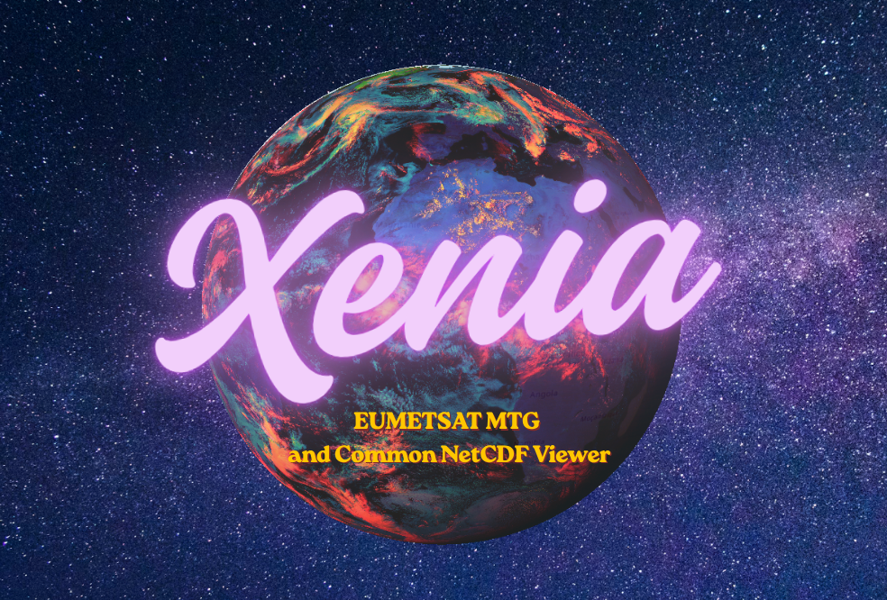
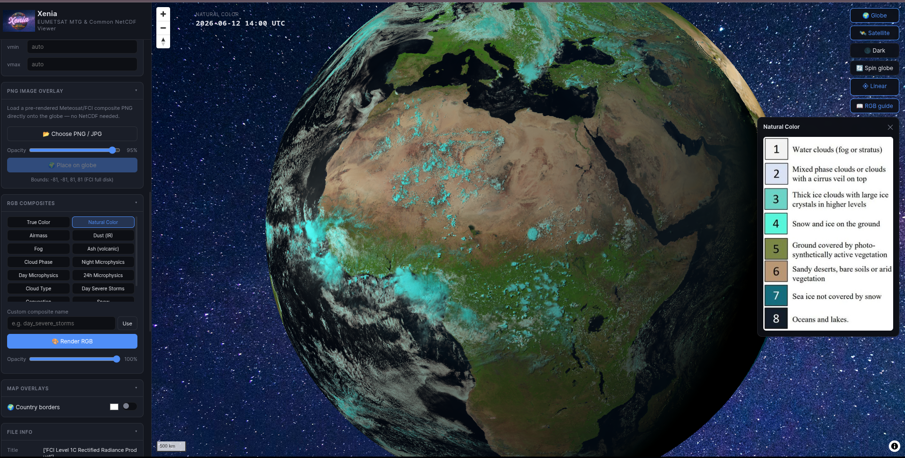
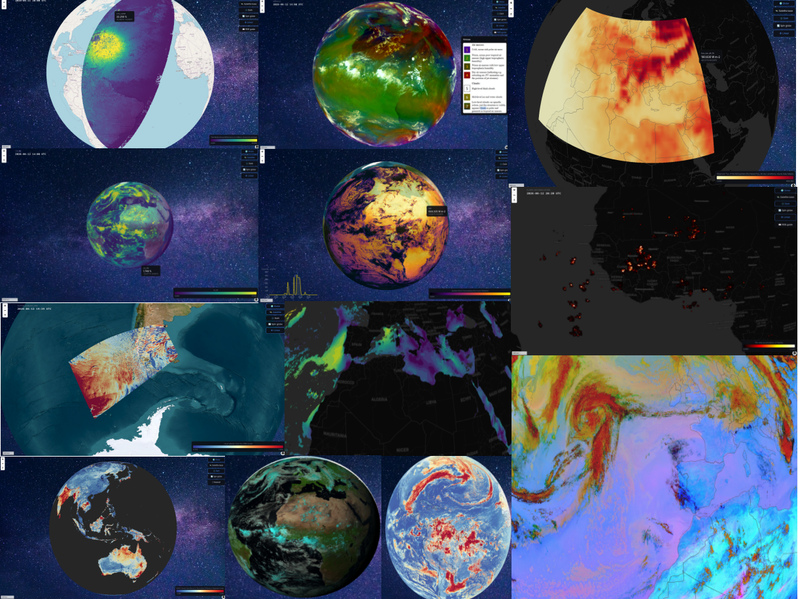
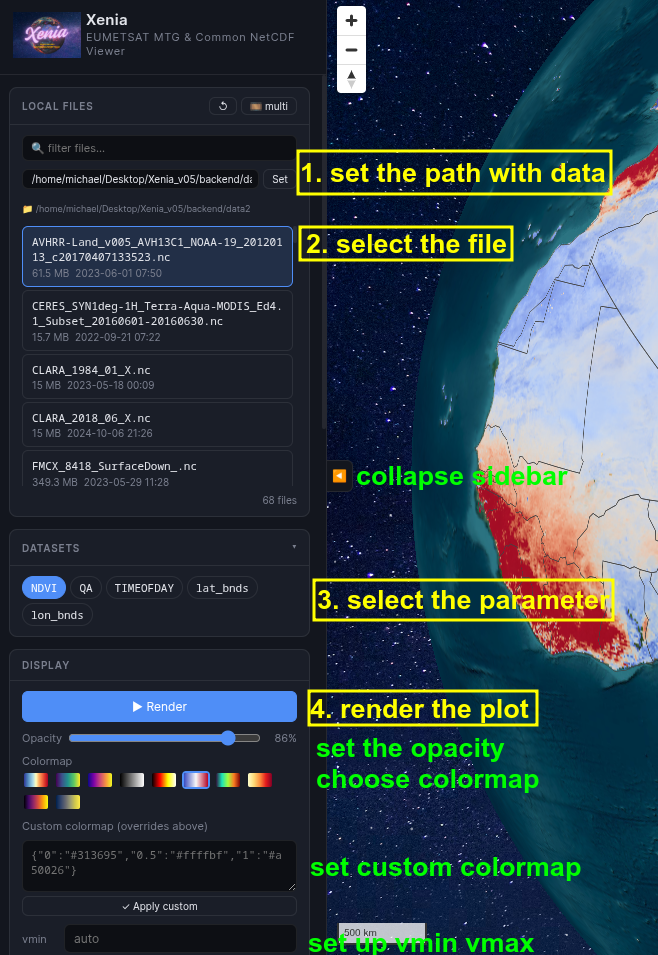
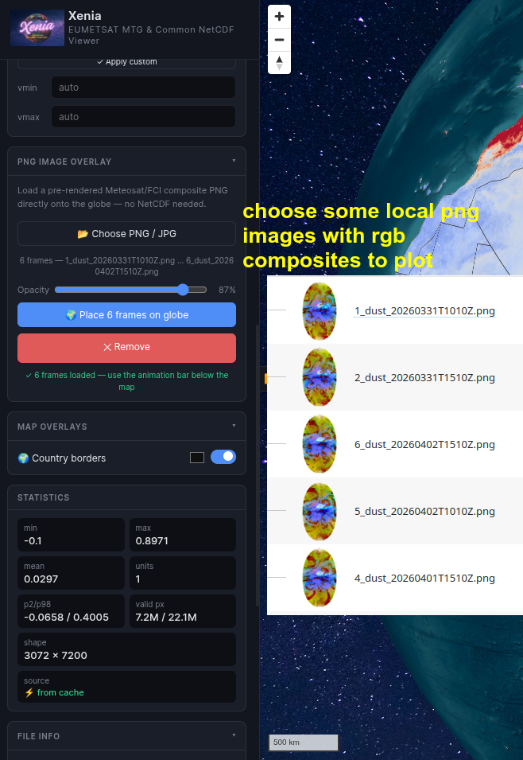
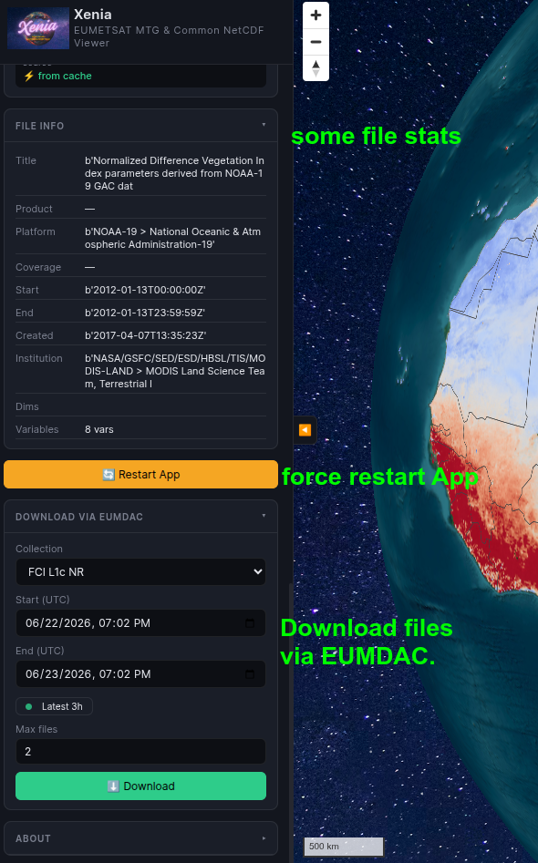

# Xenia

**A satellite and climate NetCDF viewer, fine-tuned for MTG FCI & LI products.**

<p align="center"></p> 

Xenia is a FastAPI-based web application for exploring EUMETSAT Meteosat Third Generation (MTG) satellite products, alongside a wide range of climate and atmospheric science NetCDF files. Drop a file in, pick a variable, and get a georeferenced map on an interactive 3D globe.

<div align="center">
<video src="https://github.com/user-attachments/assets/c14d743d-25a2-4de3-bf8c-3631cafd5e93" controls width="780"></video>
</div>
<p align="center"></p> 

<p align="center"></p> 

---

## Quick Checkout
1. Visit https://huggingface.co/spaces/mixstam1453/Xenia
2. Some data is already available. Click on data, select the parameter, and click Render.
3. To load multiple RGB composite images: first download and extract the demo images from here: https://github.com/mixstam1821/Xenia/releases/download/demodata/png_exports.zip and then load all the dust images or the natural_color images, and finally click Place on Globe.

## Installation

### Method 1 — Using `uv` (Recommended)

`uv` is a modern Python package manager that is **much faster** than pip — installation typically takes under 2 minutes. It also handles virtual environments automatically.

#### Step 1 — Install `uv`

**macOS / Linux:**
```bash
curl -LsSf https://astral.sh/uv/install.sh | sh
```

Then restart your terminal (or run `source ~/.bashrc` / `source ~/.zshrc`).

**Windows (PowerShell):**
```powershell
powershell -ExecutionPolicy ByPass -c "irm https://astral.sh/uv/install.ps1 | iex"
```

Then close and reopen your terminal.

Verify it works:
```bash
uv --version
```

#### Step 2 — Install Git and download Xenia

```bash
git clone https://github.com/mixstam1821/xenia.git
cd xenia
```

#### Step 3 — Install dependencies with uv

`uv` creates the virtual environment and installs everything in one command:

```bash
uv venv .venv --python 3.12
uv pip install -r requirements.txt
```

> If Python 3.12 is not installed, uv will offer to download it automatically.

#### Step 4 — Activate the environment

**macOS / Linux:**
```bash
source .venv/bin/activate
```

**Windows:**
```
.venv\Scripts\activate
```

#### Step 5 — Configure `.env` and start the server

```bash
cp backend/.env.example backend/.env   # edit backend/.env with your EUMETSAT keys if needed
cd backend
uvicorn main:app --host 0.0.0.0 --port 8994
```

Then open **http://localhost:8994** in your browser.

---

### Method 2 — Using Docker (no Python setup required)

Docker lets you run Xenia in a completely isolated container, without needing to install Python, pip, or any dependencies on your machine.

#### Step 1 — Install Docker

Go to **https://www.docker.com/products/docker-desktop/** and download **Docker Desktop** for your OS.

Run the installer and start Docker Desktop. Make sure the Docker whale icon appears in your system tray (Windows) or menu bar (macOS) before continuing.

Verify Docker is working:
```bash
docker --version
```
#### Step 2 — Install Git and download Xenia

```bash
git clone https://github.com/mixstam1821/xenia.git
cd xenia
```
#### Step 3 — Set up your `.env` file

**macOS / Linux:**
```bash
cp backend/.env.example backend/.env
```
**Windows (Command Prompt):**
```
copy backend\.env.example backend\.env
```
Open `backend/.env` and fill in your EUMETSAT credentials if you want the download feature. See Method 1 Step 6 for details.


#### Step 4 — Fix data folder permissions (Linux and macOS only)

> **Windows users: skip this step.** Docker Desktop on Windows does not have this problem — you can copy files into `backend/data/` normally via File Explorer.

On Linux and macOS, run:

```bash
sudo chown -R $USER:$USER backend/data/
```
After this, you can freely copy satellite files into `backend/data/`.

#### Step 5 — Build and run

```bash
docker compose up --build
```
The first time you run this, Docker will download the base Python image and install all dependencies inside the container. This takes around 5 minutes. Subsequent starts are instant.

When you see:
```
INFO:     Uvicorn running on http://0.0.0.0:8994
```
the app is ready.

#### Stopping Docker (if needed)

Press `Ctrl+C` in the terminal, or run:

```bash
docker compose down
```

#### Starting again next time

```bash
docker compose up
```
---

### Instructions

Xenia reads from a single directory pointed to by `MTG_DATA_DIR` (default: `./data`). Zip files downloaded from the EUMETSAT Data Store are extracted automatically on startup — drop them in directly without unpacking. Subdirectories created by extracted zips are handled transparently.

Download the demo data https://zenodo.org/records/20805415 and place it inside the `xenia/backend/data/`. This is where Xenia by default sees the data. No need to unzip the .zip files.
You can set a different folder path inside the app, on the top. Please note that if you install with Docker (Method 2), you can not set a different data folder path, but only use the `xenia/backend/data`.

Step 1. Setting a data folder path is optional; you can paste the data inside the `xenia/backend/data` and the App will see it after a refresh.
<p align="center"></p> 
<p align="center"></p> 
<p align="center"></p> 

---

### 🎉 CLI batch export 🎉 — `download_and_export.py`

One of Xenia's practical strengths is that its render pipeline is not locked inside the web UI. The `download_and_export.py` script in `backend/` lets you download FCI L1C slots from the EUMETSAT Data Store and render any number of RGB composites to **georeferenced Web-Mercator PNGs** from the command line — no browser, no server, no manual steps.

The script reads `EUMETSAT_KEY` and `EUMETSAT_SECRET` from `backend/.env` (the same file the server uses), so no additional setup is required beyond what you already configured for Xenia. See or generate EUMETSAT Data Services API keys here: https://api.eumetsat.int/api-key/

#### What it does

For each time step in the requested range the script:
1. Searches the EUMETSAT Data Store for the nearest FCI full-disk slot.
2. Downloads and extracts it (streaming, with live progress).
3. Renders the requested composites to RGBA PNGs in `backend/exported_pngs/`, reprojected to Web-Mercator with correct geographic bounds embedded in the filename.
4. Deletes the raw download immediately to keep disk usage flat — the PNGs are all that remain.

Each PNG is named `{seq}_{composite}_{timestamp}.png` so they sort correctly for animation.

#### Supported composites

`dust` · `ash` · `fog` · `airmass` · `natural_color` · `true_color` · `night_microphysics` · `24h_microphysics` · `day_microphysics` · `cloud_phase` · `cloud_type` · `overshooting_tops`

All composites use the EUMETSAT-specified per-channel `(min, max, gamma)` stretch — the same recipes as the live viewer.

#### Usage

```bash
cd backend

# Last 3 hours of dust, one slot per hour
python download_and_export.py --composite dust --hours-back 3 --freq 1h

# Explicit range, two composites, every 30 minutes
python download_and_export.py --composite dust airmass \
    --start 2026-06-20T00:00 --end 2026-06-21T00:00 --freq 30m

# Single composite, 6-hourly, full day
python download_and_export.py --composite natural_color \
    --start 2026-06-20T00:00 --end 2026-06-21T00:00 --freq 6h
```

**`--freq` format:** `<integer><suffix>` where suffix is `m` (minutes), `h` (hours), or `d` (days). Examples: `30m`, `1h`, `6h`, `2d`.

#### Loading the PNGs into Xenia

The exported PNGs are already projected in Web-Mercator and carry correct bounds. Load them directly into the map via the **PNG Image Overlay** card in the sidebar:

1. Sidebar → **PNG Image Overlay**
2. **Choose PNG / JPG** → select the files from `backend/exported_pngs/`
5. Click **Place x frames on globe**

This produces a frame-by-frame animation of the composite sequence, displayed as a georeferenced overlay on the interactive map — exactly the same as a live render, but from pre-rendered files you can share, archive, or reuse.

#### Why this matters 💯🥇

Pre-rendering to PNGs separates the expensive satellite I/O and reprojection from the viewing step. You can batch-export a full day overnight, then explore the sequence interactively with zero server load and no EUMETSAT connection. It also makes it straightforward to embed Xenia-rendered composites in reports, notebooks, or other tools that accept georeferenced images.

---

## Why to use Xenia?

Working with MTG satellite data in practice involves a lot of friction. Desktop tools like Panoply or QGIS can open NetCDF files, but they require manual projection setup and do not know anything about FCI chunk files, geostationary encoding, or EUMETSAT composite recipes. Writing a Python script works too, but it takes time and you have to repeat it for every new product type you encounter.

Xenia is a small attempt to reduce that friction. You point it at a file or a folder, and it tries to figure out the rest — what projection the data is in, how to decode it, what the sensible default stretch is — and gives you a rendered map without any setup. It is especially handy when you receive a new product and just want to see what is inside before writing any real processing code.

It is not a replacement for satpy or xarray in a production pipeline. It is a viewer: quick, local, and focused on making the data visible as fast as possible.

---

## What it covers

Xenia has a particular focus on MTG/FCI products, but it is built on a layered fallback system that handles a broad range of file types. Here is what that looks like in practice.

**MTG FCI L1C and L2.** The primary target. Xenia understands FCI chunk file grouping, the CGMS geostationary projection, CF-convention coordinate handling, and the full satpy reader stack for FCI. It also handles a number of cases where satpy is slower or less reliable than a direct approach — see the technical notes below.

**RGB composites from raw FCI bands.** Dust, Ash, Airmass, Night Microphysics, True Color, Natural Color, Day Microphysics, Cloud Phase, Fire Temperature, Snow — computed directly from brightness temperature and reflectance channels using EUMETSAT-specified per-channel stretch and gamma values. This avoids the satpy composite stack, which can be slow to initialize and sometimes fails when auxiliary data (solar zenith angle, etc.) is not available.

**Separate geometry and color caches.** Reprojection is the slow step. Xenia caches the warped float32 array and its bounds separately from the colorized PNG. Changing the colormap or stretch on a large FCI full-disk scene re-runs only the colormap step, which takes milliseconds. The expensive warp is not repeated.

**Stable native extension handling.** HDF5, PROJ, and pyresample are C extensions that do not always behave well when first-initialized from short-lived async threads. Xenia routes all native work through a single persistent thread, which keeps initialization stable and means that if something does go wrong at the native level, it surfaces as a clean HTTP error rather than a process crash.

**Broad format support.** Beyond MTG, Xenia supports several 2d geospatial data such as TROPOMI/Sentinel-5P swath data, GOES ABI, OSISAF SST, LSASAF LST, H-SAF precipitation, ERA5 and CMIP6 reanalysis, ISCCP, CERES, CLARA and RTM outputs (Stamatis et al., https://zenodo.org/records/17382343). The fallback chain is: satpy readers → xarray CF → TROPOMI subgroup loader → UXarray (experimental).

---

## Technology stack

**Backend — Python / FastAPI**

The server is built with [FastAPI](https://fastapi.tiangolo.com/), which provides async HTTP routing, automatic request validation, and a clean interface for streaming large PNG responses back to the browser. All the heavy lifting — file loading, reprojection, colorization — runs in a background thread pool so the event loop stays free.

- **[satpy](https://satpy.readthedocs.io/)** — used for reading FCI L1C and L2 files, MSG SEVIRI, GOES ABI, and other satellite formats through its reader plugin system. satpy handles the low-level format parsing, calibration, and dataset naming conventions for each sensor family.
- **[pyresample](https://pyresample.readthedocs.io/)** — used for the core reprojection work: converting data from satellite-native projections (geostationary, swath) to a WGS84 or Mercator output grid. The KD-tree resampler from pyresample handles the nearest-neighbor and weighted average interpolation.
- **[xarray](https://xarray.pydata.org/)** — the fallback reader for any file that satpy does not handle. xarray opens CF-compliant NetCDF files, decodes coordinate metadata, and provides the DataArray interface that the rest of the pipeline works with.
- **[PROJ / pyproj](https://pyproj4.github.io/pyproj/)** — coordinate reference system transformations, used under the hood by pyresample and also directly for geostationary projection math.
- **[numpy](https://numpy.org/) / [scipy](https://scipy.org/)** — array math throughout. The AMV scatter gridding, LI flash accumulation, and all colormap stretches are pure NumPy. scipy's `cKDTree` is used for the scatter-to-grid nearest-neighbor lookup.
- **[Matplotlib](https://matplotlib.org/)** — colormap application. Xenia uses Matplotlib's colormap registry to convert float32 arrays to RGBA PNGs.
- **[Pillow](https://pillow.readthedocs.io/)** — PNG encoding of the final RGBA arrays before they are streamed to the browser.

**Frontend — plain HTML / JS / MapLibre GL**

The frontend is intentionally lightweight — no build step, no framework, just HTML, CSS, and vanilla JavaScript served directly by FastAPI's static file handler.

- **[MapLibre GL JS](https://maplibre.org/)** — the web map. Rendered satellite images are added as georeferenced raster overlays on top of a base map. MapLibre handles tile loading, panning, zooming, and the coordinate system math that keeps the overlay aligned correctly.
- **Fetch API** — all communication with the backend is plain `fetch()` calls to the FastAPI endpoints (`/api/render`, `/api/recolor`, `/api/inspect`, etc.). Responses include custom HTTP headers (`X-Bounds`, `X-Vmin`, `X-Vmax`) that the frontend reads to position the image overlay and populate the UI controls.
- **Canvas API** — used for the globe spin animation and any client-side image compositing.

The separation between backend (all the science) and frontend (just display and controls) means the backend can also be used headlessly — every render endpoint returns a PNG with geographic bounds in the headers, so it is straightforward to call from a script or another service.

---

## Supported file types

### MTG FCI — Level 1C (calibrated radiances)

FCI L1C files contain top-of-atmosphere radiances and reflectances from the Flexible Combined Imager. These are the raw measurement files — one variable per spectral channel, one chunk file per segment of the full-disk scan.

Channels: VIS0.4, VIS0.5, VIS0.6, VIS0.8, NIR1.3, NIR1.6, NIR2.2, IR3.8, WV6.3, WV7.3, IR8.7, IR9.7, IR10.5, IR12.3, IR13.3 (FDHSI) plus HRV channels (HRFI).

Xenia groups the chunk files automatically, renders single channels, and can produce RGB composites directly from the raw bands.

### MTG FCI — Level 2 Products

L2 means the data has been processed beyond raw radiances into geophysical parameters. These products are derived from the L1C measurements using retrieval algorithms. Each has its own file structure, projection, and variable set.

| Product | Code | What it contains |
|---|---|---|
| Cloud Top Height & Temperature | CTTH | Cloud top pressure, height, temperature on a geostationary grid |
| Cloud Mask | CLM | Binary clear/cloudy flag per pixel |
| Cloud Type | CT | Cloud phase and type classification |
| Optimal Cloud Analysis | OCA | Multi-layer cloud optical depth, particle size, phase |
| Active Fire | FIR | Fire radiative power, fire mask |
| Outgoing Longwave Radiation | OLR | Broadband OLR at top of atmosphere |
| Accumulated Flash Area | AFA | Lightning flash area accumulation over time |
| Aerosol Single-layer Retrieval | ASR | Aerosol optical depth, Ångström exponent, on a geodetic grid |
| Atmospheric Motion Vectors | AMV | Per-vector wind speed, direction, pressure level — IR10.5, IR3.8, WV6.3, WV7.3 channels |
| Global Instability Indices | GII | Atmospheric instability indices on a geostationary grid |
| Cloud Radiative Model | CRM | Radiative fluxes derived from cloud retrievals |

### MTG LI — Level 2 Lightning Products

The Lightning Imager produces high-cadence lightning event data. These files use a sparse encoding: each detected event is a point with a geostationary column/row index, not a gridded array.

| Product | What it contains |
|---|---|
| AFA | Accumulated flash area |
| AF | Individual flash events |
| LFL | Lightning flash luminance |
| LGR | Lightning group radiance |

Xenia decodes the geostationary column/row angles using the CGMS projection formula and scatters the events onto a geographic grid for rendering.

### EUMETSAT L2 — Third-party products

| Product | What it contains |
|---|---|
| OSISAF GHRSST SST | Sea surface temperature on a lat/lon grid (OSISAF/Meteosat12) |
| LSASAF LST | Land surface temperature on a geostationary grid |
| CM SAF SSR using Heliosat-3  | SID (Surface Solar Radiation) |

### Geostationary imagers — other satellites

| Sensor | Reader |
|---|---|
| GOES-16/17/18 ABI L1B | ABI radiance channels |
| GOES ABI L2 | Cloud, LST, and derived products |
| CLAVRX | AVHRR/MODIS cloud and surface retrievals |

### TROPOMI / Sentinel-5P

TROPOMI L2 files contain atmospheric chemistry columns (SO2, NO2, O3, CO, CH4, aerosol) on an orbit swath. The files use a nested group structure that standard xarray opens incorrectly. Xenia loads the PRODUCT subgroup directly and handles the latitude/longitude 2-D coordinate arrays.

### Generic climate NetCDF

Any CF-compliant NetCDF with 1-D or 2-D lat/lon coordinates is supported through the xarray fallback path. This covers ERA5 reanalysis, CMIP6 model output, ISCCP cloud climatology, CERES radiation, CLARA satellite climate records, GPCP precipitation, and custom model output including FESOM unstructured ocean grids.

### Unstructured grids (UGRID)

In Progress.

---

## Technical notes

### Why native extensions run on a dedicated thread

FastAPI runs sync route handlers on threads borrowed from anyio's worker pool. These threads are short-lived and recycled. The problem is that native extensions like HDF5 (via h5py/netcdf4), PROJ, and pyresample's OpenMP-backed KD-tree resampler are not safe to first-initialize from an arbitrary, soon-to-be-recycled thread. The race condition between thread initialization and recycling is what causes the intermittent segfaults that are hard to reproduce but easy to trigger under load.

The fix is to run all native-touching work on a single persistent `ThreadPoolExecutor` with `max_workers=1`. That thread lives for the lifetime of the process, so the native libraries initialize once and stay initialized. All reprojection, HDF5 access, and pyresample calls go through `_run_native()`, which submits to this executor and waits with a configurable timeout.

### How AMV scatter products are rendered

Atmospheric Motion Vector files do not contain gridded data. Each wind observation is a point — a latitude, longitude, pressure level, speed, and direction. The coordinates are stored as raw `int16` with `scale_factor=0.01`, so a naive `xr.open_dataset` without careful handling returns unscaled integers.

Xenia detects this structure by checking for explicit `latitude`/`longitude` variables in the dataset (as opposed to geostationary `x`/`y` scan angles). It decodes the coordinates, applies the scale factor and fill value mask to both the coordinates and the data variable, then uses a cKDTree nearest-neighbor scatter to bin the observations onto a Mercator output grid at the native 32 km AMV grid spacing.

### How the geometry and color caches work

Reprojection is expensive. Colorization is cheap. Xenia caches them separately.

The geometry cache stores the reprojected float32 array and its geographic bounds, keyed by a SHA-256 hash of the source file path, variable name, and any dimension slices. The render cache stores the final PNG bytes, keyed by the geometry key plus colormap and stretch parameters.

When only the colormap or stretch changes, the frontend calls `/api/recolor` instead of `/api/render`. This skips the geometry entirely and re-runs only the colormap application on the already-warped array — typically under 100 ms even for full-disk FCI scenes.

### Why satpy is bypassed for RGB composites

Satpy's composite stack is designed for operational production pipelines. For interactive use it is slow to initialize, requires solar zenith angle computation for several composites, and sometimes refuses to render when auxiliary data is missing. For the IR-difference family (Dust, Ash, Airmass, Night Microphysics, Fog) and the visible composites (Natural Color, True Color, Day Microphysics), Xenia loads the raw FCI brightness temperature and reflectance bands directly from the L1C files and applies the EUMETSAT-specified per-channel `(min, max, gamma)` stretch parameters in a single NumPy pass. This is roughly 5–10x faster than the satpy path and produces identical output for the standard composites.

## Feedback

Feedback, bug reports, and feature requests are welcome. If you encounter an issue or have an idea for improvement, please open an issue on GitHub.

---

## License

MIT
